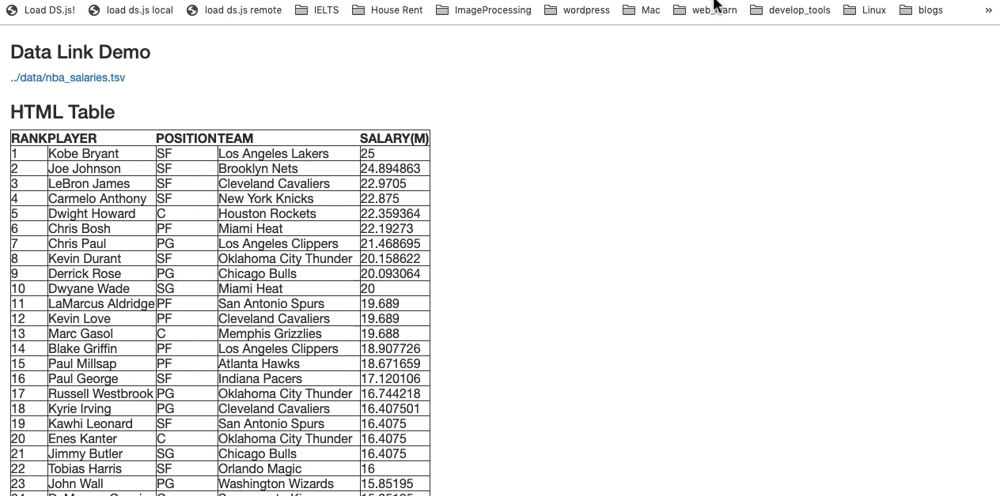

.. :Authors: - Cyrus Omar, April Wang

.. title:: Live Programming

Overview
========

TODO: Overview

Interleaving editing and execution

TODO: background, papers

REPLs
=====

Data Analysis Environments
==========================
Data scientists use data analysis environments for a variety of data science activities.
The term data science was first distinguished from pure statistics in 1997. 
University of Michigan statistics professor C.F. Jeff Wu popularized the term "data science" in his talk `"Statistics = Data Science?"`_.
He described the current state of data science work as: 1) data collection, 2) data modeling and analysis, and 3) problem solving and decision support.
He argued that there should be a balanced curriculum that puts more emphasis on data collection, and there should be more focus on large and complex data which usually interface with other disciplines.

.. _`"Statistics = Data Science?"`: http://www2.isye.gatech.edu/∼jeffwu/presentations/datascience.pdf

.. container:: bib-item

  .. bibliography:: data-analysis-environments.bib
    :filter: key == 'donoho:2017'

  This article reflects on the past 50 years of history of data science. It introduces how the field of data science emerged as a superset of statistics and machine learning, driven by commercial rather than intellectual developments. It also visions how the field of data science will grow in the next 50 years.

Data science has grown rapidly over the last decade as datasets have increased rapidly in size and ubiquity. 
Kery and Myers :cite:`kery:2017:exploring` observe that data science practices are a form of exploratory programming, with the results of previous steps determining the next steps that the programmer will take.
Muller et al. :cite:`muller:2019` investigated how data science workers engaged with data.

.. container:: bib-item

  .. bibliography:: data-analysis-environments.bib
    :filter: key == 'kery:2017:exploring'

  This paper reviews and describes what exploratory programming is. It identifies two properties with exploratory programming: 1) writing code serves as a purpose of prototyping or experimenting different ideas; 2) the goal is open-ended, and evolves through the process of programming. It outlines four dimensions to study exploratory programming tasks: applications, required code quality, ease of difficulty of exploration, and the exploration process.  

.. container:: bib-item

  .. bibliography:: data-analysis-environments.bib
    :filter: key == 'muller:2019'

  This paper describes the practice of data science with a focus on how data science workers engage with data. The authors conducted an interview study with 21 data science professionals with diverse backgrounds and classifying how they work with data. It reports five approaches to data: data as given; as captured; as curated; as designed; and as created.

This chapter reflects on the challenges in the common practice of data analysis, and reports novel designs that address the challenges.
The rest of the chapter is organized as the following:
1) the first part of the article introduces novel tools and systems that assist with data collection, cleaning, and analyzing,
2) the second part of the article introduces computational notebooks, a common tool for documenting and sharing the process of data science.

Tools for Data Collection
--------------------------
Data can be collected from a variety of sources.
For example, data can be downloaded as a public dataset from online repositories, or generated by physical sensors (weather data, personal health data), or collected from existing websites (flight prices, stock prices), or manually crafted (the grade of students' assignments).

Web Scraping by Demonstration
^^^^^^^^^^^^^^^^^^^^^^^^^^^^^
Web scraping is a common practice for data science workers to collect data from an exisitng website.
In data science education, there is an increasing call to encourage students to collect and explore authentic data that are meaningful to themselves rather than providing them a standard dataset.
However, the additional effort to learn the scraping process may block novices' interests to explore the data. One approach that has been explored is using Programming by Demonstration (PBD) to facilitate the process of web data collection.

.. _Helena: http://helena-lang.org/

.. container:: bib-item

  .. bibliography:: data-analysis-environments2.bib
    :filter: key == 'chasins:2018'
    
  This paper presents Rousillon, a programming-by-demonstration system for scraping hierarchically-structured data from different webpages. The authors first implemented Helena_, a high-level programming language for automating repetitive interactions on webpages. They then applied Programming by Demonstration (PBD) so that users only need to demonstrate how to collect data in the first row from a hierarchical website, and the system learns from the demonstration and generalizes to the other rows. They found that this novel approach could help users finish scraping tasks 8 times faster than a traditional web scraping tool (Selenium) through a within-subject study with 15 computer scientists.

Example-Centric Live Data Analysis Environments
^^^^^^^^^^^^^^^^^^^^^^^^^^^^^^^^^^^^^^^^^^^^^^^
Another approach is to turn any webpage into a data analysis environment.
**DS.js** :cite:`zhang:2017` explored this idea by introducing the idea of example-centric live programming.
This idea has been further explored in **Mallard** :cite:`zhang:2019`, which investigated the idea of turning web as a contextualized prototyping environment for machine learning.

.. container:: bib-item

  .. bibliography:: data-analysis-environments.bib
    :filter: key == 'zhang:2017'
    
  This paper discusses the limitation of production-grade data science programming environments and the opportunity for example-centric approach to learn data science. 
  It introduces DS.js, a bookmarklet that embeds the programming environment directly into the webpage. 
  DS.js attaches code editors to the HTML tables or datasets on the target website.
  By doing so, it embeds a lightweight data science environment directly into the data with live previews and visualizations of the computing results.
  To lower the barriers of learning, DS.js further generates API suggestions to manipulate the selected data piece in the table.
  In addition, DS.js encapsulates all the user-generated code into a single URL for sharing.
  The first-use evaluation with 8 subjects proofs the usability of the system.

.. container:: bib-item

  .. bibliography:: data-analysis-environments.bib
    :filter: key == 'zhang:2019'

  This paper presents Mallard, which contributes to the idea of enabling the web as a contextualized machine learning prototyping tool.  
  Mallard simplifies the process of collecting and parsing training data, installing and configuring computational environments for machine learning. 
  With Mallard, users can directly augment web data with ML-driven results.
  Mallard is shown to be useful for hobbyist-level machine learning prototyping through a set of case studies, including augmenting social media sites with sentiment analysis, performing style transfer on Google Image search.
  It lowers the barriers for amateur users to experiment with pre-trained machine learning models by applying it directly to existing webpages.

Tools for Data Cleaning
----------------------------------
Often times, data science workers receive poor-structured and incomplete datasets.
The datasets must be cleaned or redesigned to meet the requirement of the algorithms or models.
It is said that data scientists spend a substantial portion of their time collecting and cleaning the data rather than mining and modeling data.

    "60% of data scientists spend most of their time cleaning and labeling data. 57% said it was the least enjoyable thing they do."
    -- `2016 Data Science Report, CrowdFlower`_

    .. _`2016 Data Science Report, CrowdFlower`: https://visit.figure-eight.com/data-science-report.html

The challenge here is that there might be variants of situations that need to be considered. 
For example, a missing value may have different representations (N/A, null, '', undefined).
Data science workers may develop their own strategies to handle missing data (N/As) - deleting a record if it has too many missing attributes; using min/max/mean/median/mod to fill numerical missing attributes.
Data science workers may need to normalize numerical data, remove non-related attributes and outlier records, and encode discrete attributes to numerical values.
It is a tedious process to iterate over all possible issues that come up during the cleaning stage.
It is also difficult to specify the data cleaning transformation and reuse it across different contexts.

Data Transformation Suggestion Systems
^^^^^^^^^^^^^^^^^^^^^^^^^^^^^^^^^^^^^^
What if the system can prompt users for these transformations without asking them to write code?
Wrangler uses rule-based inference to interactively suggest users valid transformations based on their current selection :cite:`kandel:2011`.

.. raw:: html

    

    <iframe title="vimeo-player" src="https://player.vimeo.com/video/19185801" width="640" height="480" frameborder="0" allowfullscreen></iframe>
    

.. container:: bib-item

  .. bibliography:: data-analysis-environments.bib
    :filter: key == 'kandel:2011'
  
  This paper introduces Wrangler, an interactive system for creating data transformations. 
  It uses rule-based inference to interactively suggest users valid transformations based on their current selection. 
  All the transformations are represented in natural language to reduce the cost of writing and reading code.
  Users can specify parameters in the transformations by directly editing this natural language representation.
  In addition, Wrangler captures the editing histories of the transformation so that users can share and reuse the cleaning scripts.
  An evaluation study demonstrates Wrangler's ability to significantly reduce the specification time compared to manual editing in Excel.

Data Cleaning by Demonstration
^^^^^^^^^^^^^^^^^^^^^^^^^^^^^^
Despite the benefits of suggesting transformations in Wrangler, data science workers are limited to preset rules.
Programming by Demonstration (PBD) can be used to intelligently suggest transformations by generalizing from a small number of manual programmer actions.
**FlashFill** is a classical example of using programming synthesis to accelerate the data cleaning process :cite:`gulwani:2011`.

.. raw:: html

    

    <iframe width="678" height="381" src="https://www.youtube.com/embed/ulbalvFcAYk" frameborder="0" allow="accelerometer; autoplay; encrypted-media; gyroscope; picture-in-picture" allowfullscreen></iframe>
    

.. container:: bib-item

  .. bibliography:: data-analysis-environments.bib
    :filter: key == 'gulwani:2011'

  FlashFill is used for automatic string processing. 
  It first takes input-output examples from users and synthesizes a program in a string expression language based on the algorithm.
  It then computes the output from any given input based on the synthesizing program.
  The algorithm is able to produce accurate and efficient results on more than 100 various benchmark examples drawn from online help forums.
  It also provides noise detection and an interactive model where users are prompted to provide outputs for ambiguous inputs.

Using Crowdsourcing for Data Cleaning
^^^^^^^^^^^^^^^^^^^^^^^^^^^^^^^^^^^^^
Some data cleaning tasks can be difficult to solve by an algorithm but can be easily judged by human knowledge.
For example, it is hard to use an algorithmic approach to perfectly solve the problem of entity resolution.
Entity resolution refers to merging and combining different representations for the same real-world entity.
For example, a dataset may contain values for "University of Michigan", "U of M", "Umich", "UM".
They identically refer to one entity and data science workers need to replace all the ambiguous values with the same one.
A popular approach for these tasks is crowdsourcing - asking human workers to combine the entities.
However, this may not be scalable. 
When the size of the dataset is large, it becomes difficult for human workers to split and coordinate the work.
Studies have explored hybrid human-machine approaches for addressing this issue :cite:`wang:2012`.

.. container:: bib-item

  .. bibliography:: data-analysis-environments.bib
    :filter: key == 'wang:2012'

  CrowdER proposes a new workflow for solving entity resolutions using crowdsourcing.
  It improves the state-of-art pair-based HITs (human intelligence tasks) with cluster-based HITs.
  On a high level, it first uses an algorithm to filter and cluster potential values with high probabilities of duplicated entities that need crowd workers to judge.
  Instead of showing crowd works pairwise comparisons, it shows cluster-based values and asks crowd workers to group these candidates.
  This hybrid approach improves both efficiency and accuracy on two real world datasets compared to machine-only or human-only approaches.

Tools for Data Analysis
------------------------------
Finally, the core stage of data science is data analysis, which includes understanding patterns and relations in the data, exploring different representations of the data, and finally extracting insights from the data.

Data Visualization
^^^^^^^^^^^^^^^^^^
Data visualization can help data science workers intuitively see and explore the trends and patterns in data by creating visual representations of the information.
Vega-Lite_ :cite:`satyanarayan:2017` is a popular tool for creating data visualization.

 .. _Vega: https://vega.github.io/vega/
 .. _Vega-Lite: https://vega.github.io/vega-lite/

.. container:: bib-item

  .. bibliography:: data-analysis-environments.bib
    :filter: key == 'satyanarayan:2017'
    
  Vega-Lite_ is a high-level grammar for rapidly generating visualizations to support analysis based on Vega_.
  In Vega, users often need to provide a specification of the visual elements.
  Vega-Lite automates the construction of some specifications (e.g., axis, legends, scales).
  It provides a concise JSON syntax for mapping data to properties of graphical marks.
  Vega-Lite is compiled to Vega and can only express a subset of interactive visualizations in Vega.

.. container:: bib-item

  .. bibliography:: data-analysis-environments2.bib
    :filter: key == 'hoffswell:2018'

  Novice users may find it difficult to draw connections with the specification and the runtime state in Vega.
  This paper explores the design space of embedded visualization in code.
  With this in situ visualization of the runtime state of variables in Vega specifications, novice users reported performance improvements in both speed and accuracy.
  
Tools like Vega support the quick generation of visual representations, but they may require users to have expert programming skills in order to achieve the custom graphical design.
The project DearData_ creatively brings the view that people use data not only to become more efficient, but also become more humane.
It calls people to collect and hand draw their personal data on postcards.
In this way, people have more freeform expressions of the visual elements, but they have to draw every single data points manually.
The project DataInk :cite:`xia:2018` manages to bridge the gap between traditional visualization tools and freeform hand drawing.

.. _DearData: http://www.dear-data.com/theproject

.. raw:: html

  

  <iframe width="678" height="381" src="https://www.youtube.com/embed/xlVZKGClcC0?list=TLPQMTUxMTIwMTl9VIVPBNOdFQ" frameborder="0" allow="accelerometer; autoplay; encrypted-media; gyroscope; picture-in-picture" allowfullscreen></iframe>
  

.. container:: bib-item

  .. bibliography:: data-analysis-environments2.bib
    :filter: key == 'xia:2018'

  DataInk is designed for creating whimsical and personal data visualization. 
  It allows users to create expressive data visualizations on a digital canvas through direct pen and touch input.
  It enables users to bind data attributes with visual properties (e.g., shape, color) on the design.
  The research team evaluated DataInk with 8 designers and non-experts.
  The results have shown that this tool encourages users to creatively generate whimsical and personal data visualizations.

Statistical Analysis
^^^^^^^^^^^^^^^^^^^^
Statistical analysis is the science of under covering patterns and trends in data. 
It attempts to use collected data samples to deduce or infer meaning about the underlying dataset or the reality.
There are many statistical tests designed for different contexts and purposes, which may stand only under specific preconditions.
Thus, it is a difficult task for data science workers, especially people with little or no statistical expertise, to decide which statistical tests to use given a specific dataset and hypotheses.

.. container:: bib-item

  .. bibliography:: data-analysis-environments2.bib
    :filter: key == 'jun:2019'

  Tea is a high-level declarative language to translate users' hypotheses and domain knowledge into all valid statistical tests.
  Users describe their study design, parametric assumptions, and their hypotheses, and Tea suggests a set of valid statistical tests.
  An initial evaluation found that Tea can help non-expert users avoid common mistakes and false conclusions. 
  In addition, Tea can achieve or even beat expert recommendations on textbook tutorials.

Computational notebooks
-----------------------
Till now, we discussed challenges and novel tools that targeted at a particular stage in data science workflow.
In complex data science projects, multiple stages are involved and they intertwine with each other.
Data science workers often need to make comparisons and explore alternatives.
This process requires them to quickly script experimental analysis, inspect the intermediate results, document their thoughts, communicate with others, and be able to generate a report for others to replicate the analysis.

    "The main challenge here is how to consolidate all of the various notes, freehand sketches, emails, scripts, and output data files created throughout an experiment to aid in writing."
    -- Philip Guo, `Data Science Workflow: Overview and Challenges`_

    .. _`Data Science Workflow: Overview and Challenges`: https://cacm.acm.org/blogs/blog-cacm/169199-data-science-workflow-overview-and-challenges/fulltext

Computational notebook platforms allow users to write executable notebook documents that combine code chunks, intermediate output, and rich text elements.
It helps data science workers to present, reproduce, share, and collaborate their analysis.
There are many computational notebook platforms designed for different analysis languages and environments, for example, `Apache Zeppelin`_, `Spark Notebook`_, `Observable`_, `RStudio`_, `Wolfram Notebooks`_.
Among these computational notebook platforms, `Jupyter Notebook`_ supports more than 40 programming languages and has been widely used for writing and sharing computational narratives in various contexts.
It evolved from IPython :cite:`perez:2007`, which is a terminal-based interactive shell for creating interactive visualizations for scientific computing.
Wrapping IPython as the kernel, Jupyter Notebook has a powerful graphical interface that allows users to edit and execute "cells" -- small chunks of code or markdown text.

.. _`Apache Zeppelin`: https://zeppelin.apache.org
.. _`Spark Notebook`: http://spark-notebook.io
.. _`Observable`: https://observablehq.com
.. _`RStudio`: https://www.rstudio.com/
.. _`Wolfram Notebooks`: http://www.wolfram.com/notebooks/
.. _`Jupyter Notebook`: https://jupyter.org

.. container:: bib-item

  .. bibliography:: data-analysis-environments3.bib
    :filter: key == 'perez:2007'

  The IPython project has explored designs to extend Python's interactive capabilities.
  Python is designed as an open and general-purpose environment while IPython aims to build special-purpose interactive environments for scientific computing.
  It introduces graphical interface toolkits for plotting.
  It also enhances the Python shell for interactive distributed and parallel computing.

.. image:: ../images/jupyter.gif
  :width: 600
  :alt: Jupyter Notebook

Managing the Masses on Notebooks
^^^^^^^^^^^^^^^^^^^^^^^^^^^^^^^^
Although computational notebooks are designed to support not only performing, but also documenting and sharing analysis, most people consider it personal, exploratory, and messy.

.. container:: bib-item

  .. bibliography:: data-analysis-environments2.bib
    :filter: key == 'rule:2018'

  This paper reports a large scale analysis of over 1 million open-source computational notebooks.
  The results show that only one in four held explanatory text.
  Moreover, the textual descriptions in notebooks tend to focus heavily on describing methods rather than discussing reasoning or results.
  The authors conclude that there is a tension between exploration and explanation in writing and sharing computational notebooks.

.. container:: bib-item

  .. bibliography:: data-analysis-environments2.bib
    :filter: key == 'kery:2018'

  This paper explores data scientists' coding behavior using computational notebooks through an interview study with 21 data scientists.
  The results highlight the challenges of tracking history of experimentation.
  Participants reported that both formal and informal versioning attempts caused issues.
  Formal versioning mechanisms such as using Git may hinder the exploration, as data science workers rapidly iterate and alternate their analysis.
  Informal versioning attempts include copying code, keeping unused code, and commenting out code before repurposing analysis.
  Informal versioning creates masses in the notebook.
  Data science workers have to maintain a strong mental map of the cells.
  Data science workers often need to pause their exploration and actively curate notebooks into a structured narrative.
  The results further aligned with Rule's findings that explanation annotations were rarely used in the exploration phase of work.

To address the challenges in informal versioning, Kery et al. designed Variolite, a code editing tool with local versioning control :cite:`kery:2017`.
They later integrated this design into Jupyter notebook with Verdant :cite:`kery:2019`.
Head et al. took a different design approach :cite:`head:2019` using code gathring technique.

.. container:: bib-item

  .. bibliography:: data-analysis-environments2.bib
    :filter: key == 'kery:2017'

  This paper explores the design space of informal versioning design.
  It demonstrates Variolite, a lightweight local versioning control tool to help data scientists manage their explorations.
  Variolite is an Atom editor extension that enables users to version a section of the code based on users' selection.
  A preliminary usability study shows that 9 out of 10 participants found the tool easy to use and all 10 of them would consider use it in real life. 

.. container:: bib-item

  .. bibliography:: data-analysis-environments2.bib
    :filter: key == 'kery:2019'

  This paper explores the design space in notebook code enviroments to help data scientists forage for information in their history.
  It introduces Verdant, a Jupyter extension with an enhanced history view with algorithmic and visualization techniques for data science workers to better foraging past analysis choices.
  A think-aloud evaluation shows that participants were able to find specific information on another person's past project with the aid of Verdant.

.. container:: bib-item

  .. bibliography:: data-analysis-environments2.bib
    :filter: key == 'head:2019'

  The authors started with how data science workers naturally adopted informal versioning attempts (e.g., keeping old analysis code, copying cells).
  They explored the idea of code gathering to help data science workers trace minimal "slice" of code that generates the computational results.
  They evaluated the tool through a qualitative usability study with 12 professional analysts.
  The results show that participants found the tools useful for finding, cleaning, recovering, and comparing versions of different code. 

Debugging
=========

Interactive Debuggers
---------------------

Program Visualization
---------------------

Programming by Demonstration
============================

Direct Manipulation Programming
===============================

Graphical User Interface Design
-------------------------------

Game Development
----------------

Live Coding
===========

TODO: in music

Programmable Physical Environments
==================================

