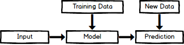
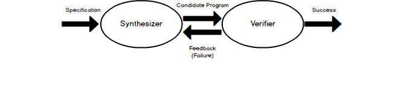

.. :Authors: - Cyrus Omar, Abhitej Ganta

.. title:: Programming Assistants

Overview
========

**Programming assistants** are tools integrated into development environments that enable more effective programming by allowing the developer to focus less on the syntactical and logical problems occured during development and more on the big picture of projects. Why do we need programming assistants? As more complex and time-consuming projects arise, assistants can significantly reduce the time and effort a programmer exhausts during development, while also reducing the probability of errors occuring.

Programming assistants can be highly sophisticated themselves, with most using advanced artificial intelligence, machine learning and natural language processing models. However, most models can be represented by the following diagram:

where the input can be range from syntactical structure (abstract syntax trees, parsed text, edit action history) to program runtime data. The chosen model is done so based on accuracy and runtime comparisons between various hypothesized models. Even after the model is chosen, it is further evaluated and tuned. Once a model is chosen and trained on input data, new data is introduced for prediction and the results are published. Models can output various types of predictions including: single hole and multiple hole fillings in a program and arbitrary edits throughout a program. The main areas of research for programming assistants are discussed further below.

Program Synthesis
=================

**Program Synthesis** refers to the process of code synthesis based on a programmer's specifications. It is intended to serve as the ultimate abstraction and allows the assistant to implement instructions typically containing a mixture of a natual language and programmatic syntax. This area of research originates from the idea that computers are very good at following explicit instructions, but humans are not necessarily good at writing those instructions. Wouldn't it be more efficient to tell a computer what the developer wants it to do and to leave the implementation details to the computer? The main promise of Program Synthesis is to automate the trivial parts of programming, allowing the developer to focus on the big picture.

Before discussing how synthesis occurs, it is important to discuss the various ways to specify program behavior. Most programming languages are not helpful for telling a program synthesizer what a developer wants it to do. Therefore, there must be a way to provide a specification of what the program should do. There are many styles in place including:

1. Complete Formal Specification using a formula (e.g. `∀x. P(x) = x*2` for a program that doubles the input)
2. Input/Output pairs that serve as examples of what the program should be doing (e.g. (2,4), (4,8) for the program that doubles)
3. Demonstrations of how the program should compute the output (Very similar to #2 but tends to have some intermediate steps as well)

The two main types of Program Synthesis are deductive and inductive. **Deductive Program Synthesis** uses complete formal specifications while **Inductive Program Synthesis** uses less formal specifications and relies primarily on iterative search techniques to find implementations

Deductive Program Synthesis is focused on an approach in which the derivation task is regarded as a problem of proving a mathematical theorem :cite:`manna1992fundamentals`. Manna and Waldinger discuss that in order to write a program that meets the specifications, a proof of existence must be conducted showing that for any input, the output satisfies the specified conditions. In order for the proof to be sufficiently constructive, upon finding the existence of an output, it is required to state the computational means used to determine the existence. This is then used as a basis for the program that is eventually created. Manna and Waldinger continue to discuss specifications, proving of theorems and deduction rules for the remainder of the paper.

Inductive Program Synthesis (IPS) has been a more popular area of research in the last decade. This is mainly due to the realization that most are not familiar with complicated mathematical theorems and prefer to synthesize using less formal specifications. There are many different variations of IPS as there are many different iterative approaches, but most follow the same overall architecture containing a synthesizer and a verifier:

A synthesizer produces a 'candidate program' based on the specifications provided and sends the program to a verifier to validate that the program fully satisfies the specifications. If the verifier successfully validates the program, no further action is taken. However, if the verifier determines that the candidate is not satisfactory, it provides feedback to the synthesizer to be used to guide the development of a new candidate program. This process is repeated until the candidate program passes all of the specification.

Gvero and Kuncak have a proposed a new code assistance tool, anyCode, for integrated development environments (IDEs) that produces a list of syntheses based on user-entered free-form queries :cite:`gvero2015synthesizing`. The queries contain a mixture of English and Java syntax and produce expressions that account for the correct syntax, types and scoping rules of Java.

Given the query `open file example.txt`, anyCode would return a list of potential Java expressions:

.. code-block:: Java

  File file = new File("/Users/example/example.txt");
  BufferedReader reader = new BufferedReader(new FileReader("/Users/example/example.txt"));

The authors state that the key feature that differentiates their tool is that it does not take into account any prior code context. The main take aways of their tool are that it often produces the expected code fragments, tolerates the flexibility of the English language, and it can repair incorrect Java expressions that use the wrong syntax or missing arguments.

anyCode was evaluated with 45 examples where the effectiveness criteria was that it was able to successfully synthesize expected expressions and to list them among the top 10 solutions. The two models used to build the tool, unigram and PCFG, were evaluated separately and together. Using only the unigram model, the expected expression was only in the top 10 27% of the time and 18% using the PCFG model.

However, when both models were used, the expected expression was in the top 10 82% of time and was the #1 option 44% of the time. More implementation details of the two models can be found in the paper. anyCode was given an average runtime of 60 ms to generate the top 10 expressions, proving that it can effectively and efficiently synthesize expressions.

.. container:: bib-item

  .. bibliography:: programming-assistants.bib
    :filter: key == 'manna1992fundamentals'

  This paper explains the foundations and fundamentals of deductive program synthesis detailing the mathematical approach behind it.

.. container:: bib-item

  .. bibliography:: programming-assistants.bib
    :filter: key == 'gvero2015synthesizing'

  This paper introduces demonstrates program synthesis as code suggestions using Java syntax and English free-form queries as inputs.

Code Completion
---------------

**Code Completion** systems are simple program synthesis systems that generate code snippets for insertion at the cursor, whereas other program synthesis systems may fill multiple holes in a code corpus. It is intended to speed up the process of coding applications by reducing typos and other mistakes. Code Completion assistants serves as convenient way to access function syntax and descriptions, significantly reducing the amount of memorization required.

Common techniques to achieve this include auto completion popups while typing, querying parameters of functions, querying hints related to syntax errors. The models used in Code Completion are very similar to those used in Program Synthesis but tend to use different inputs.

Common training inputs include:
- Parsed code corpuses
- Abstract syntax trees

Most of the popular IDEs (Visual Studio, Eclipse, IntelliSense, IntelliJ IDEA) contain some form of basic code completion but many new research projects have started picking up.

Raychev, Vechev and Yahav addressed the code completion problem using APIs. Unlike most code completion tools, their work synthesizes completions for holes in code with most likely method calls :cite:`raychev2014code`. Take the following simple machine learning example:

.. code-block:: python

  X = data[X_features]
  y = data[y_label]

  X_tr, X_te, y_tr, y_te = train_test_split(X, y, 0.2)
  model = RandomForestClassifier()
  ?
  model.score(X_te, y_te)

Given the hole in the code, this code completion tool can accurately fill in `model.fit(X_tr, y_tr)` for the question mark. The team is able to do this by treating the code completion problem as a natural language processing problem of predicting probabilities of sentences. Static analysis of method call sequences and a statistical language model are used to generate a list of ranked sentences based on likelihoods.

There are four key aspects in this tool:
1. Completion across multiple types - In one given run, the tool is able to make completions for objects of various types.
2. Complete of parameters - While generating completions for methods, the tool is also able to fill in the correct method parameters.
3. Holes as sequences - The tool is able to recognize if multiple method invocations are missing in a given hole and fills in the missing.
4. New fused completions - The tool is able to make completions on sequences and methods it has not been trained on before.

The evaluation of the tools proved it to be very fast and effective. Out of the 84 examples tested on, the desired completion appeared in the top 3 results in 90% of the cases. More details on the implementation of the model and the evaluation metrics used can be found in the paper :cite:`raychev2014code`.

Pythia, an AI-assisted code completion system, is another Microsoft research project that has since been deployed to Visual Studio IntelliCode :cite:`svyatkovskiy2019pythia`. Pythia not only suggests method completions but also search for relevant APIs for suggestion. Pythia also uses abstract syntax trees as input to train large-scale deep learning models and attempts to predict completions within 100 ms. To compare the perform of the Pythia model, the researchers also generated models using the frequency approach and Markov-Chain approach.

The frequency baseline model was generated by training a model based on the occurrence count of methods in a corpus. It was further improved by providing additional context information concerning whether or not the code was inside an "if" statement. The Markov-Chain model was model trained to determine the next method given a sequence of prior commands for certain Python libraries. For example:

.. code-block:: python

  os.path.isfile -> os.remove -> ?

After creating the baseline models, a long short-term memory model was created with backpropagation through time, a gradient-based neural network training algorithm, applied to the model. More implementation details can be found in the paper :cite:`svyatkovskiy2019pythia`. Comparing all models created in the study, the frequency and Markov-Chain baselines were 67% and 83% accurate in predicting the expected completion within the top 5 results. The Pythia model was able to out perfom both models with an accuracy of 92% for the same metric, giving the researchers enough evidence to publish and integrate the tool into Visual Studio.

.. container:: bib-item

  .. bibliography:: programming-assistants.bib
    :filter: key == 'raychev2014code'

  This paper demonstrates the use of APIs to generate code completions for holes in corpuses given a query character.

.. container:: bib-item

  .. bibliography:: programming-assistants.bib
    :filter: key == 'svyatkovskiy2019pythia'

  This paper demonstrates the use of abstract syntax trees to train a deep learning model for code completion suggestions.

Refactoring
===========

**Refactoring** refers to the process of restructuring existing code without changing the program's behavior and is a large area of interest in programming assistant research. It is intended to improve the nonfunctional attributes of a program. Typically, code refactoring applies small changes to various areas of a program and most development environments have already integrated support for basic refactoring. Detecting problems early and refactoring source code can save developers time and effort debugging in the future.

The main benefits of refactoring can be categorized into either **maintainability**: Fixing issues is very easy because the code is easy to read and easy to understand, or **extensibility**: Extending the capabilities of the application is very easy because the codes uses recognizable design patterns and is flexible.

(TODO: Suggesting Program Edits)

Software engineers at Microsoft are currently developing and integrating a refactoring assistant that recognizes editing patterns in source code and suggest other edits :cite:`miltner2019fly`.

 `This article <https://devblogs.microsoft.com/visualstudio/refactoring-made-easy-with-intellicode/>`_ demonstrates Blue-Pencil in action as it was recently integrated into Visual Studio 2019.

Although this is a small example, making changes like these is a very tedious process. Scaling this up to larger projects creates a real problem with a large resource requirement. This is the exact problem the Blue-Pencil solution aims to tackle. Blue-Pencil non intrusively watches and learn from user edits and makes suggestions accordingly. It attempts to identify repetitive edits using the document edit history by generating explanations for each of the user's edits to predict actions to take.

How does it work? Given a history of edits on a given document, Blue-Pencil takes an oracle-guided approach to generate explanations for the history. More implementation details are discussed in the paper.

The model was evaluated with 37 document editing sessions in two software development languages (C# and SQL) coming from various sources. The model provided 206 suggestions and only yielded 23 false positives giving it a final precision value of 0.89 with the average suggestion time being 199 ms. More details on the implementation and results of the study can be found here.

.. container:: bib-item

  .. bibliography:: programming-assistants.bib
    :filter: key == 'miltner2019fly'

  This paper demonstrates the use of document edit history to suggest code refactoring based on repetitive editing patterns.

Program Repair
==============

**Program Repair** refers to the process of automatic repairing of a code corpus that contains type and/or runtime errors, manifested as exceptions or failed tests. It is intended to speed up the time and effort exhausted to debug a software project. Debugging can consume a significant amount of time the larger or more complex the project is. Not only does the root cause of an issue have to be found but the bug itself has to be fixed making the whole process very tedious. Some common techniques used in Program Repair are statistical fault localization and component-based program synthesis.

A very common approach for Program Repair is using **Genetic Programming**, a computational method inspired by biological evolution which evolves computer programs tailored to a specific task. Researchers at CMU are doing just this by combining program analysis methods with evolutionary computation to automatically repair bugs :cite:`weimer2010automatic`. The key feature about the research was that it did not rely on formal specifications, allowing it to be more flexible to a larger range of software.

The work introduces algorithms to find and minimize the number of repairs required in a program based on test cases that describe the desired functionality. The algorithms are generic enough to span a broad range of bugs. The research also introduces a novel and efficient representation to apply Genetic Programming to Program Repair with experimental results showing how the approach generates repairs for several types of bugs in 11 programs. The solution was able to fix the bugs across all 11 programs (over 60,000 lines of code total) in 2000 seconds, an impressive feat considering the total size of the projects analyzed.

Another Program Repair tool, SemFix is an automated program repair method based on symbolic execution, constraint solving and program synthesis. It utilizes statistical fault localization in order to identify and rank lines of code based on their suspiciousness, determines the correct specifications of buggy statements using a method similar to angelic debugging and finally uses program synthesis to correct the statement :cite:`nguyen2013semfix`.

To evaluate the tool, a buggy test set of 50 was used with a total of 90 bugs. The performance and speed of SemFix was also compared to those of GenProg, a competing automatic debugging tool. SemFix proved to be more successful and faster with the average speed repair speed being 100 ms. Although SemFix outperformed GenProg, it was still only able to debug 48 of the 90 bugs successfully (GenProg was only able to debug 16 of the 90) which seems problematic. However, the SemFix team clearly addresses this and explains the drawbacks of the tool. More details can be found in the paper.

.. container:: bib-item

  .. bibliography:: programming-assistants.bib
    :filter: key == 'weimer2010automatic'

  This paper demonstrates the use of genetic programming to automatically fix programming bugs.

.. container:: bib-item

  .. bibliography:: programming-assistants.bib
    :filter: key == 'nguyen2013semfix'

  This paper demonstrates the use of statistical fault localization to determine and fix buggy areas of a code corpus.

Interactive Proof Assistants
============================
